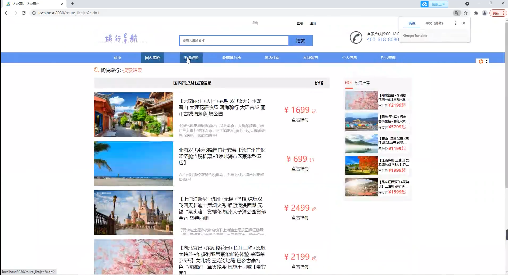
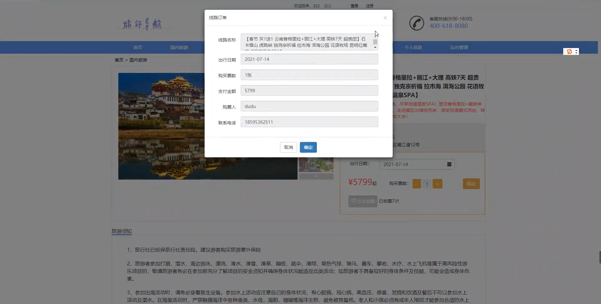
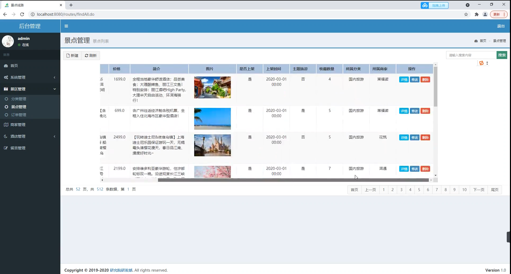
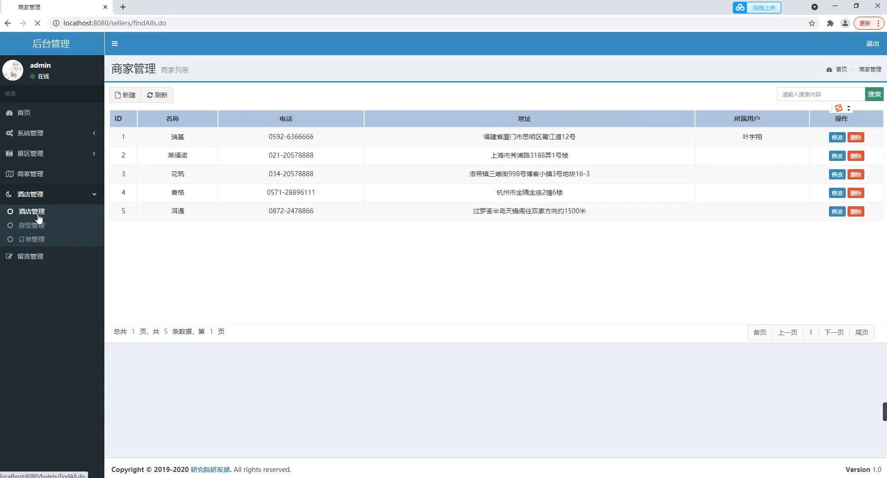
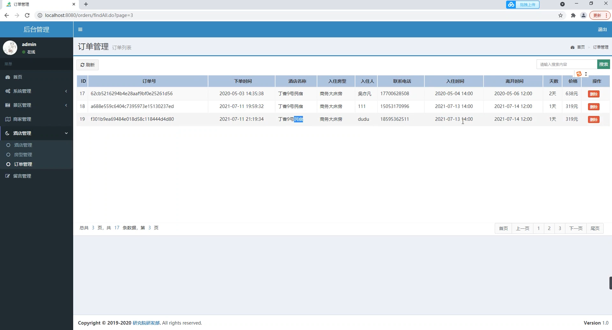

## 基于SSM框架的在线旅游网站管理系统

###  获取sql数据库文件: 从戎源码网 (https://armycodes.com/) QQ: 386869957 QQ群: 377586148
###  所有系统地址: (https://github.com/YuLin-Coder/AllProjectCatalog) 
###  所有项目以及源代码本人均调试运行无问题 可支持远程安装部署调试、定制修改、代码讲解

## 项目介绍
基于SSM框架的在线旅游网站管理系统，系统包含用户和管理员两种角色：,系统分为前台和后台两大模块，主要功能如下。
【前台功能】
首页、国内旅游景点展示、国外旅游景点展示、收藏排行榜、酒店住宿、在线留言、旅游下单等

【后台功能】
景区管理：分类管理、订单管理、订单管理
商家管理、
酒店管理：房型管理、订单管理
留言管理

## 项目技术
- 编程语言：Java
- 数据库：MySQL
- 前端技术：JSP、JavaScript、jquery
- 后端技术：Spring、SpringMVC、MyBatis

## 运行环境
- JDK版本：JDK1.8及以上
- 开发工具：IDEA、Ecplise、Myecplise都可以
- 数据库: MySQL5.7及以上

## 运行截图

